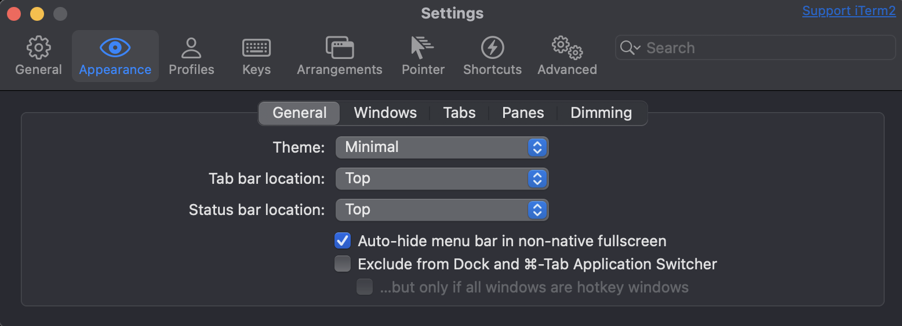

# iTerm2 Configuration

This document describes the iTerm2 terminal emulator configuration used in this dotfiles repository.

## Overview

iTerm2 is a powerful terminal emulator for macOS that offers extensive customization options. This configuration includes a custom profile named "thrsouza" with optimized settings for development work.

## Profile Configuration

The main profile configuration is stored in `iterm2/thrsouza.json`. This profile includes:

### Key Features

- **Color Scheme**: Custom color palette optimized for both light and dark modes
- **Font**: JetBrains Mono with ligatures support
- **Transparency**: Subtle background blur effect
- **Window Size**: 128x32 columns/rows
- **Unlimited Scrollback**: For better command history access

### Color Configuration

The profile uses separate color schemes for light and dark modes:

#### Dark Mode Colors
- **Background**: Dark gray (#141414)
- **Foreground**: Light gray (#D6D6D6)
- **Selection**: Blue-tinted selection color
- **Cursor**: White cursor with custom styling

#### Light Mode Colors
- **Background**: Light gray (#1E1E1E)
- **Foreground**: Dark gray (#EAEAEA)
- **Selection**: Blue-tinted selection color
- **Cursor**: Black cursor with custom styling

### Font Settings

- **Primary Font**: JetBrainsMonoNFM-Regular 14pt
- **Non-ASCII Font**: JetBrainsMonoNLNFM-Regular 12pt
- **Ligatures**: Enabled for both ASCII and non-ASCII characters
- **Bold and Italic**: Enabled for enhanced text styling

### Appearance Settings

The configuration includes several appearance optimizations:

- **Transparency**: 8% background transparency
- **Blur**: Background blur effect with 4.47px radius
- **Visual Bell**: Enabled for notifications
- **Blinking Cursor**: Disabled for reduced distraction

## Appearance Screenshots

The following screenshots demonstrate the iTerm2 appearance settings:

### General Appearance

*General appearance configuration including colors, fonts, and basic settings*

### Window Settings

*Window configuration including transparency, blur, and window behavior*

### Tab Configuration

*Tab appearance and behavior settings*

### Panel Configuration

*Panel and split view configuration options*

### Dimming Settings

*Background dimming and focus settings*

## Installation

To use this iTerm2 configuration:

1. **Import Profile**:
   - Open iTerm2
   - Go to Preferences → Profiles
   - Click the gear icon → Import JSON Profiles
   - Select `iterm2/thrsouza.json`

2. **Set as Default** (Optional):
   - In Preferences → Profiles
   - Select the "thrsouza" profile
   - Click "Other Actions" → Set as Default

3. **Font Installation** (if needed):
   - Download and install JetBrains Mono font family
   - Available from: https://www.jetbrains.com/lp/mono/

## Customization

### Modifying Colors

To modify the color scheme:

1. Open iTerm2 Preferences
2. Navigate to Profiles → Colors
3. Use the color picker to adjust individual colors
4. Export the updated profile to replace `thrsouza.json`

### Adding New Profiles

To create additional profiles:

1. Create a new profile in iTerm2
2. Configure desired settings
3. Export as JSON
4. Add to the `iterm2/` directory
5. Update this documentation

## Troubleshooting

### Font Issues
If JetBrains Mono fonts are not displaying correctly:
- Ensure fonts are properly installed in `/Library/Fonts/` or `~/Library/Fonts/`
- Restart iTerm2 after font installation
- Verify font names match exactly in the configuration

### Color Display Issues
If colors appear incorrect:
- Check that your display supports the configured color space (sRGB/P3)
- Verify terminal type is set to `xterm-256color`
- Ensure "Use Separate Colors for Light and Dark Mode" is enabled if desired

### Performance Issues
If experiencing performance problems:
- Reduce transparency level
- Disable background blur
- Lower scrollback buffer size

## Related Files

- `iterm2/thrsouza.json` - Main profile configuration
- `assets/iterm2-appearence-*.png` - Appearance screenshots

## References

- [iTerm2 Official Documentation](https://iterm2.com/documentation.html)
- [JetBrains Mono Font](https://www.jetbrains.com/lp/mono/)
- [iTerm2 Color Schemes](https://iterm2colorschemes.com/) 
